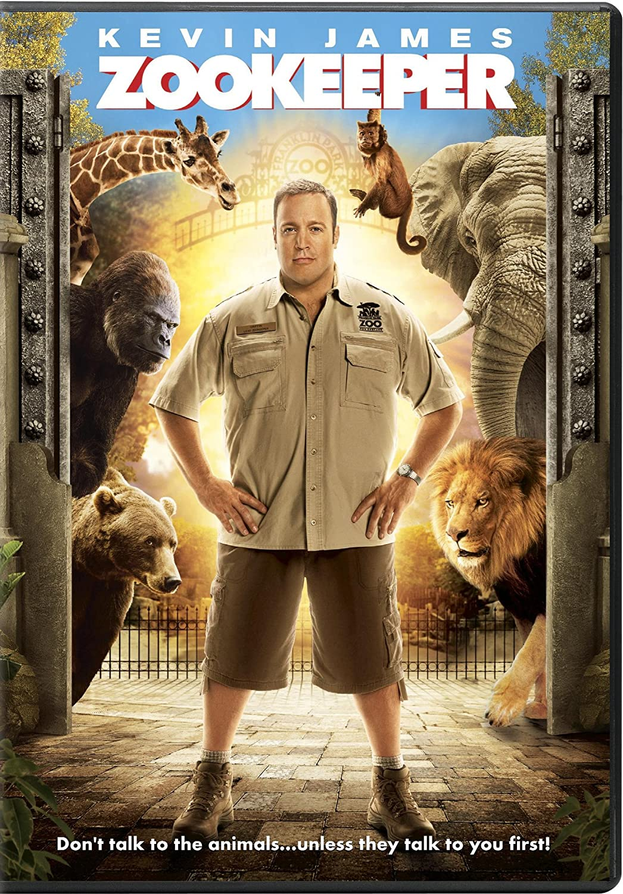
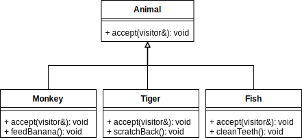
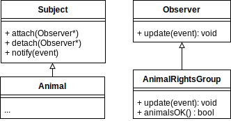

# 270191U025-Software-Architecture-assignment-4

In the lecture several design patterns were introduced. You have already used one these in the previous exercise when injecting the log object into the calculator. This is in fact a _strategy_ pattern which is a very commonly used pattern.

Today's exercise covers two new patterns; the _visitor_ pattern and the _observer_ pattern.

<div>


<div>

## Visitor Pattern

The intent of the visitor pattern is to decouple an algorithm from the data structure it operates on. We use the example of a _zoo_ to elaborate this. A zoo houses several animals see each with concrete operations that are relevant only for the specific animals. In the context of the pattern these animals are the _data structure_ which is acted on by the algorithm.

<div>

</div>

Keeping the animals fit and healthy requires that a zoo _keeper_ visits these animals to take care of needs on a daily basis. The keeper is in this case the algorithm which acts upon the data structure by feeding, scratching backs, etc.

In the following parts we will implement the classes just described.

<div>

</div>

1. Examine the `test_animals.cpp` test case
   - make sure that you understand the relation between the `accept` and `visit` methods
2. Implement the `accept` method of the `Monkey`, `Tiger` and `Fish` class. This should call the visit method of the visitor with an concrete instance of an animal. Hint, use `this` keyword.

```python
    # do double-dispatch like this
    visitor.visit(this);
```

3. Re-run the test to verify that the first section of the test is passing
4. Implement the `Tourist` class
   - Implement the `visit` method(s) of the `Tourist` class. Whenever visiting an animal this should add store the name of the lower-case name of the animal in the vector `visited`
5. Re-run the test to verify the second section of the test is passing

## Observer Pattern

Our zoo has been attracting unwanted media attention; tourist have fed the monkeys, keepers have forgotten to scratch the tigers backs.
To avoid further media attention we must keep track of who visits the animals and what actions they perform.

<div>

</div>

This is a perfect situation to use an _observer_ pattern. In this case we consider the animals subjects and implement an observer _AnimalRightsGroup_.
The animal rights group monitors the animals to see that the zoo treats all animals according to their needs.

1. Examine the `test_observers.cpp` test case
2. Implement the `attach` and `detach` method of the `Subject` class
   - attach should add a pointer to an `Observer` to the `subscribers` vector
   - detach should remove the pointer
3. Implement the `notify` method of the `Subject` class. This should call the `update` method of every subscriber, like in the pseudo code below:

   ```python
   for s in subscribers:
       s.update(event)
   ```

4. Implement the `feed_banana`, `scratch_back` and `clean_teeth` method of the `Monkey`, `Tiger` and `Fish` class. These should invoke the `notify` function with the appropriate event, for example:
   ```cpp
   void Monkey::feedBanana(visitor &v)
   {
       notify(AnimalEvent::monkeyFed);
   }
   ```
5. Implement the `update` method of the `AnimalRightsGroup`. Depending on the type of event recieved this should update the number of times the animals have been fed, scratched, etc.
   Seek inspiration from the `animals_ok` method.

6. Run the tests again to verify that they all pass
